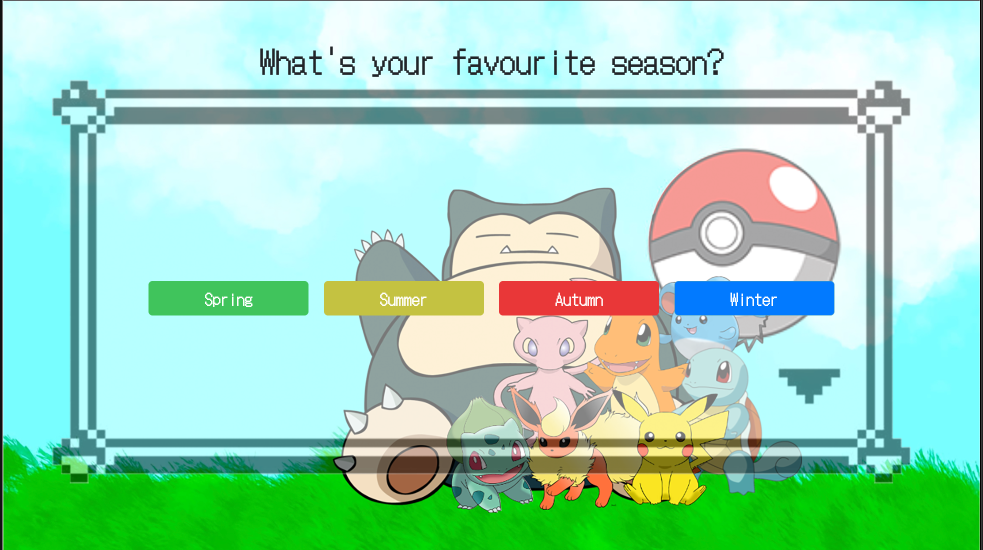
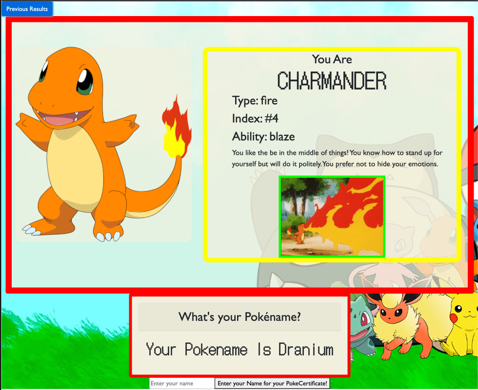
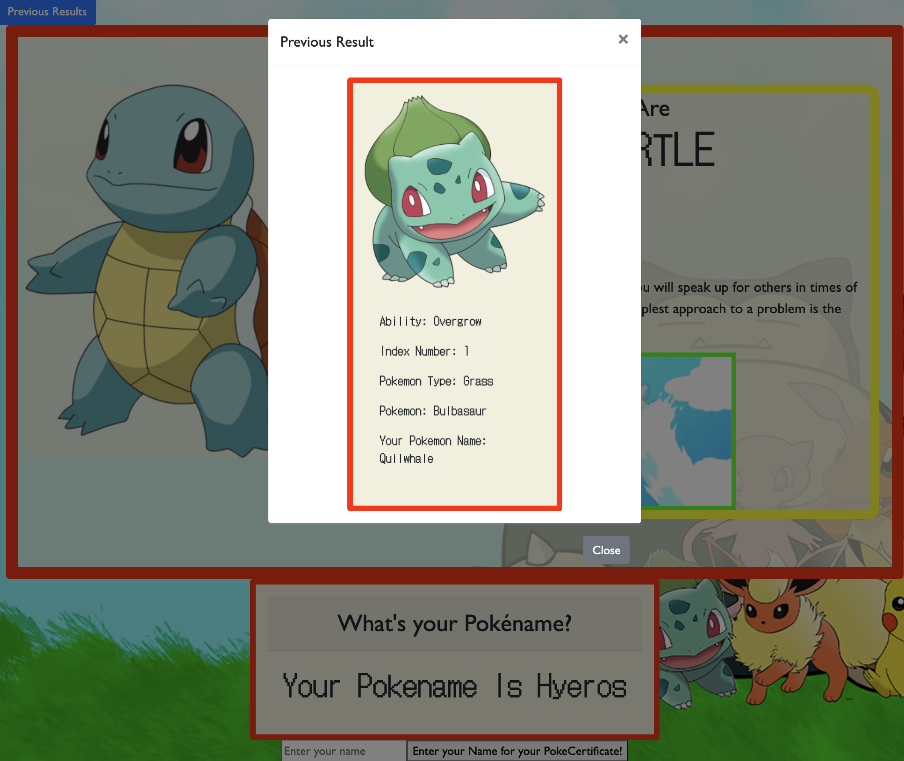

# pokepod-pokemon-game

## A Pokemon personality quiz

This project is a personality quiz, where you can find out your inner Pokemon. 

## Usage

Website link: https://eliza-an.github.io/pokepod-pokemon-quiz/ 

Presentation link: https://docs.google.com/presentation/d/1xvI9kkRF_sB_1TI7BykB7ocBtfHd167sjw6BHkbiZcE/edit?usp=sharing

On loading the quiz in your browser, click the start button on the title page to begin.

Then simply answer all nine questions and then you will be presented with your results. 
 
 

To print your certifcate, just submit your name and click the button.
 

To view previous results, click the 'previous results' button to load the modal.
 

## Development

This application was structured in HTML, customised in CSS and made functional in JavaScript. We used components from Bootstrap and Google Fonts. Local storage is used to store the user's result and then display the previous result. 

The results page uses the PokeAPI to return statistics related to the result pokemon. We also use the Giphy API to return a gif of that pokemon. Thirdly there is the FunGenerator API which returns a pokéname - this is a blended name of existing pokemon.

### Potential future developments:

- Currently the quiz result returns of one of five possible pokémon; In the future it could expand to include additional pokemon as possible results, depending on the availability of corresponding gifs from the Giphy API.

- Currently the quiz has nine questions; While this feels like a good length, it would be possible to add additional questions.

- Currently the results page of the quiz provides the user with a Pokéname which is randomly generated via API; In future we could concatenate the user's name with the Pokename to create a more customised name. 

- Currently the previous results modal displays the most recent result; This could be expanded to show multiple most recent results.

- Currently this quiz uses Pokémon from Generation 1 - the original 150 pokemon available when the game was first released; In future we could build a quiz for other generations of pokemon.

## Credits
- https://pokeapi.co/
- https://developers.giphy.com/docs/api/
- https://fungenerators.com/api/namegen/
- https://forum.freecodecamp.org/t/solved-center-btn-group-super-easy-solution/160504
- https://stackoverflow.com/questions/43044598/how-to-align-button-group-in-the-centre-html-css
- https://developer.mozilla.org/en-US/docs/Web/CSS/CSS_Grid_Layout/Basic_Concepts_of_Grid_Layout
- https://getbootstrap.com/docs/4.0/components/buttons/

links to the pokemon images used:  
- https://www.pngwing.com/en/search?q=pokemon Transparent Pokemon PNGs
- https://www.freeiconspng.com/img/18167  Download Pokemon Png HQ Pictures
- https://www.freeiconspng.com/img/18160  Get Pokemon Png Pictures
- https://www.freeiconspng.com/img/18161  Render pokemon png
- https://www.freeiconspng.com/img/18185  Download Pokemon Latest Version 2018      
- https://www.freeiconspng.com/img/18184  Png Pokemon Designs
- https://www.freeiconspng.com/img/18188  Png Pokemon Download High quality
- https://www.freeiconspng.com/img/24004  flareon pokemon png
- https://www.pngegg.com/en/png-mokdc  Snorlax Pokemon
- https://www.freeiconspng.com/img/45331  Pokemon ball png 

## License

Please refer to the licence in the repo.
